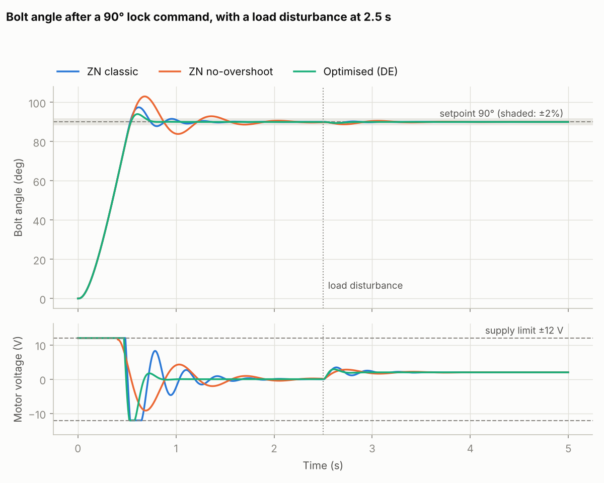
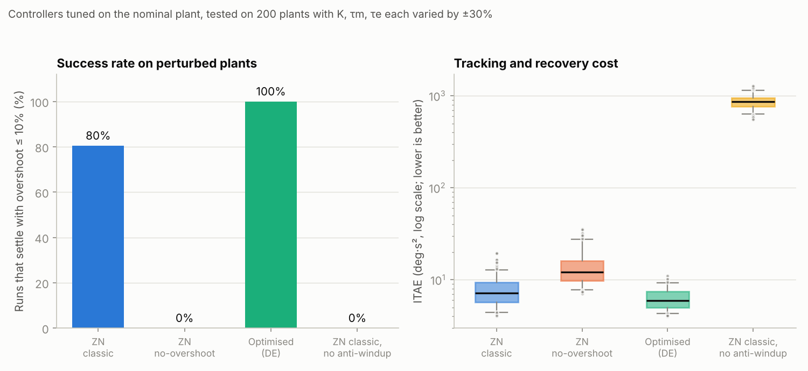
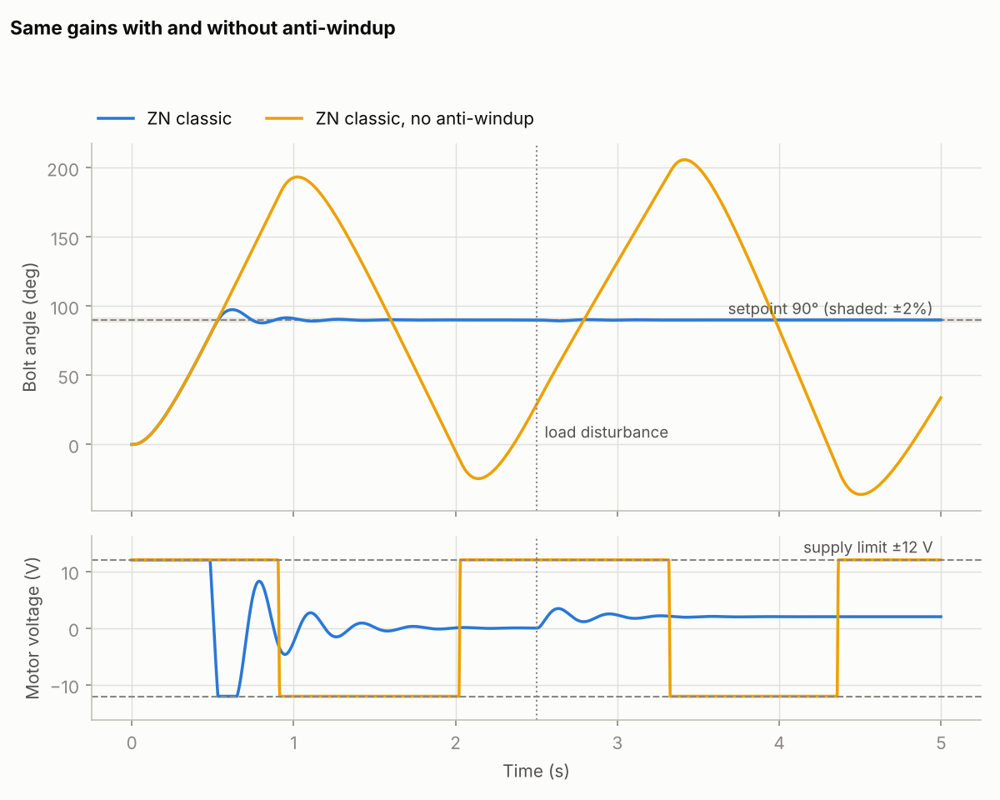

# PID tuning for a door-lock actuator

A simulation study of how to tune a PID controller for a motorised door-lock bolt. It compares
classic Ziegler-Nichols tuning with numerical optimisation, shows why anti-windup matters when the
motor saturates, and tests how well each tuning holds up when the plant is not exactly the one it
was tuned for.

The project extends a PID door-locking coursework project (MATLAB/Simulink) into Python, with
quantitative comparisons and tests.



## The problem

The lock bolt must swing 90° from unlocked to locked. A motor drives it from a 12 V supply, so the
controller output saturates at ±12 V. Partway through the run (t = 2.5 s) a constant load
disturbance acts on the bolt, equivalent to −2 V at the motor input (think of a stiff latch or
friction). A good controller should move the bolt quickly, avoid slamming past the end stop, settle,
and recover from the disturbance.

## Model

The actuator is a DC motor with two lags and an integrator (voltage in, bolt angle out):

```
G(s) = K / ( s (τm s + 1)(τe s + 1) )      K = 20 deg/s per V,  τm = 0.15 s,  τe = 0.01 s
```

The parameter values are **illustrative**, chosen to give a plausible lock actuator. They are not
measured from real hardware. The plant is discretised with a zero-order hold at 2 ms and simulated
in closed loop with a discrete PID controller (derivative on measurement with a low-pass filter,
output clipped to ±12 V).

## Tuning methods

| Controller | How the gains were chosen |
|---|---|
| **ZN classic** | Ziegler-Nichols closed-loop rule: Kp = 0.6 Ku, Ti = Pu/2, Td = Pu/8 |
| **ZN no-overshoot** | Ziegler-Nichols "no overshoot" variant: Kp = 0.2 Ku, Ti = Pu/2, Td = Pu/3 |
| **Optimised (DE)** | Differential evolution minimising ITAE plus a penalty on overshoot above 5% |
| **ZN classic, no anti-windup** | Same gains as ZN classic, but the integrator is not protected during saturation |

Ku (5.33 V/deg) and Pu (0.243 s) are the ultimate gain and period of the plant under
proportional-only control. They come from a closed-form Routh-Hurwitz analysis, and a test checks the
result against the simulation (the loop decays at 0.8 Ku and grows at 1.2 Ku, and oscillates with
period Pu at Ku). On real hardware they would be found by experiment.

| Controller | Kp (V/deg) | Ki (V/deg·s) | Kd (V·s/deg) |
|---|---|---|---|
| ZN classic | 3.20 | 26.30 | 0.097 |
| ZN no-overshoot | 1.07 | 8.77 | 0.087 |
| Optimised (DE) | 3.41 | 19.94 | 0.158 |

## Results on the nominal plant

| Controller | Overshoot | Rise time | Settling (±2%) | ITAE | Peak error after disturbance | Recovery time |
|---|---|---|---|---|---|---|
| ZN classic | 8.3% | 0.36 s | 0.83 s | 7.00 | 0.67° | 0.19 s |
| ZN no-overshoot | 14.4% | 0.36 s | 1.46 s | 11.97 | 1.23° | 0.63 s |
| **Optimised (DE)** | **4.4%** | 0.36 s | **0.69 s** | **5.98** | **0.56°** | **0.18 s** |
| ZN classic, no anti-windup | 114.8% | 0.36 s | never | 894.5 | 126.1° | never |

Full numbers: `results/nominal_metrics.csv`. Recovery time is measured until the error stays within
0.5% of the setpoint.

## Robustness on perturbed plants

The gains above were tuned on the nominal plant. To see how they hold up, each controller was
simulated on 200 random plants with K, τm and τe each scaled by a random factor in ±30%.
A run counts as a success if it settles within ±2% before the disturbance with overshoot of at most 10%.



| Controller | Success rate | Median ITAE | 90th percentile ITAE | Median overshoot |
|---|---|---|---|---|
| ZN classic | 80.5% | 7.16 | 11.08 | 8.6% |
| ZN no-overshoot | 0% | 12.06 | 21.42 | 14.7% |
| **Optimised (DE)** | **100%** | **5.96** | **8.97** | **4.8%** |
| ZN classic, no anti-windup | 0% | 865.7 | 1090 | 115.9% |

Full numbers: `results/robustness_summary.csv` (per-run data in `results/robustness_runs.csv`).
In `robustness_summary.csv`, `median_settling_s` only counts runs that settled, so read it together
with `never_settled_pct`.

## What the results show

- **The rise time is the same for every controller (0.36 s).** The motor is saturated at 12 V during
  the rise, so the supply limit sets the speed. Tuning only affects what happens after that.
- **Anti-windup is essential here.** With identical gains, removing it turns an 8% overshoot into
  115% and the bolt never settles (see the figure below). While the motor is saturated, the integrator keeps
  charging, and then drives the bolt far past the setpoint.
- **Optimisation beat Ziegler-Nichols on this problem**: lower overshoot (4.4% vs 8.3%), faster
  settling (0.69 s vs 0.83 s), 14% lower ITAE, and smaller disturbance deviation.
- **The "no overshoot" Ziegler-Nichols rule overshoots by 14%.** The rule is derived for a linear
  loop, and here the saturated start of the move breaks that assumption.
- **The optimised gains also held up when the plant changed by ±30%**, meeting the success
  criterion on all 200 perturbed plants, versus 80.5% for ZN classic. Treat this carefully: the optimiser
  was given the exact nominal model and the same test scenario (see limitations).



## Run it

```bash
pip install -r requirements.txt
python run_experiments.py          # about 30-60 s; writes tables and figures to results/
python run_experiments.py --quick  # smaller optimiser budget and fewer plants
python -m pytest                   # unit tests
```

The optimiser is seeded, so results are reproducible. On Windows and macOS, keep the
`if __name__ == "__main__"` guard in `run_experiments.py` (the optimiser uses worker processes; use
`--workers 1` to avoid them).

## Repository layout

```
pidlab/
  plant.py        actuator model, discretisation, closed-form ultimate gain and period
  controller.py   discrete PID with filtered derivative, saturation, anti-windup
  simulate.py     closed-loop simulation of one scenario (step + load disturbance)
  metrics.py      overshoot, rise/settling time, ITAE, disturbance metrics
  tuning.py       Ziegler-Nichols rules and differential-evolution optimiser
  robustness.py   random plant perturbations and summary statistics
run_experiments.py  runs everything and writes results/
tests/              unit tests (9)
results/            tables (CSV) and figures (PNG)
```

## Limitations

- The plant is a simple linear model with made-up parameters. It has no friction, backlash, sensor
  noise or quantisation, and it was not identified from a real lock.
- The optimiser tunes against the exact nominal model and the same step-plus-disturbance scenario
  used for evaluation. The robustness test varies the plant but not the scenario. On a real system the
  model would have to be identified first, which is the harder part.
- The cost function (ITAE plus an overshoot penalty of 50 per % above 5%) and the success
  criterion (overshoot ≤ 10%) are design choices. Different weights would give different gains.
- Ziegler-Nichols is computed from the analytic Ku and Pu rather than from an experiment.

## Possible extensions

- Add measurement noise and an encoder quantisation model, and see how the derivative term changes the optimum.
- Compare other anti-windup schemes (back-calculation) with the clamping used here.
- Optimise for the worst case over a set of plants instead of only the nominal one.
- Check the same controllers in the original Simulink model.

## Acknowledgements

Developed with assistance from Claude (Anthropic).

## License

MIT, see `LICENSE`.
